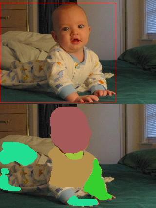
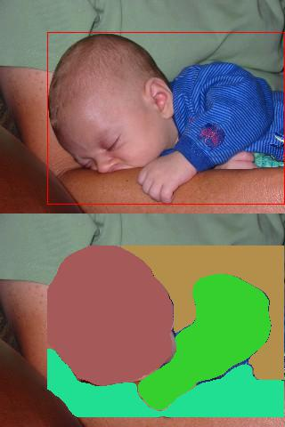
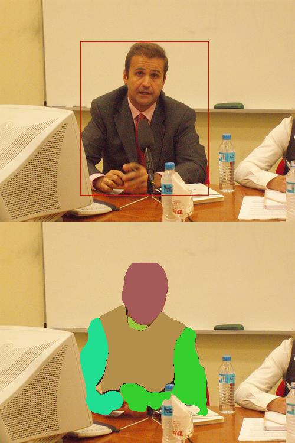

# Stacked hourglass for human parts segmentation
## Network Architecture
The entire system takes a image and a bounding box of a dominant person instance as its input. The region inside the bounding box is warped into 256 x 256 and fed into the network. The network utilizes the stacked hourglass network in [1]. It consists of n (n = 3) continuous hourglass modules. Each module predicts a nPart x 64 x 64 mask. The mask produced by the last module is the prediction of the entire network, with other masks taken for intermediate supervision. Specifically, it outputs an array of n nPart x 64 x 64 masks, each mask compared directly with the ground truth, where mean error square loss function is applied.

## Data Preprocession
The model is trained using data of the person category in PASCAL-Part Dataset. Each instance of people has 24 part masks. To compress data and speedup training, some parts are merged. For example, The masks for eyes and heads are merged. Only 7 parts are remained after the preprocession. Data augmentation technique including random color-shifting and flipping are taken to increase capacity of the model.

## Training Detail
We train the model in SGD with learning rate 0.0025, mini-batch size 8. After 55 epochs, we achieve average IoU between prediction and ground truth of 0.2170 for training set and 0.1584 for validation set.

## Demo
Pretrained model is available on [BaiduYun](https://pan.baidu.com/s/1gfwttGB). Download and put the model in `/exp/voc/default/`, then run scripts below.
```
cd src/demo
th demo.th
```

Some samples are shown below:
  

  

  

#### Reference
[1]	A. Newell, K. Yang, and J. Deng, “Stacked Hourglass Networks for Human Pose Estimation,” arXiv.org, vol. cs.CV. 23-Mar-2016.
